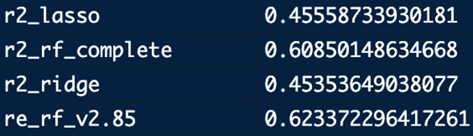
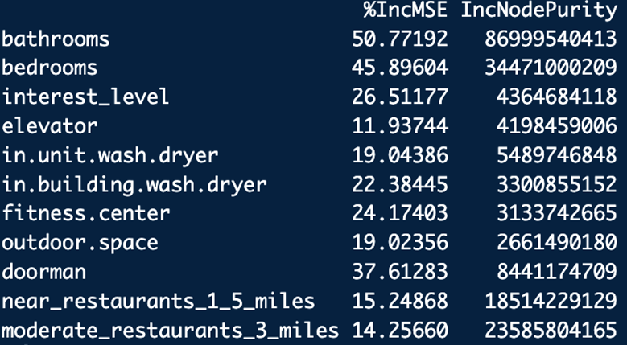
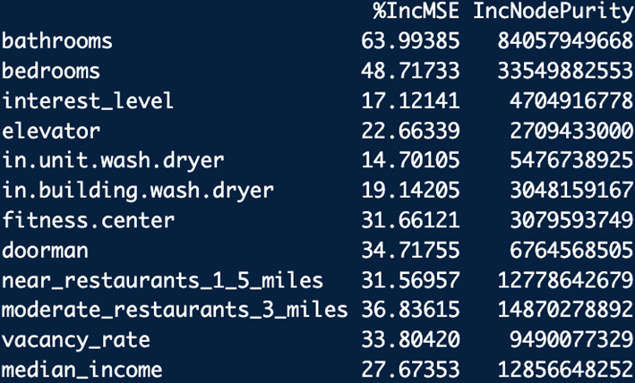
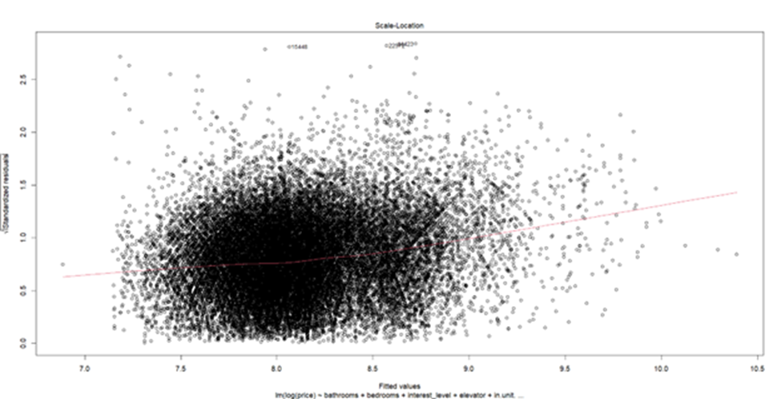
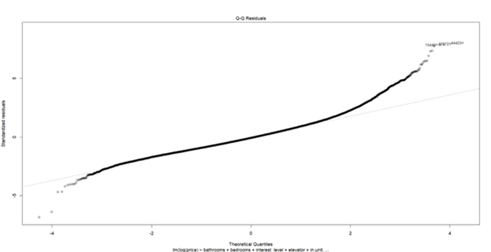
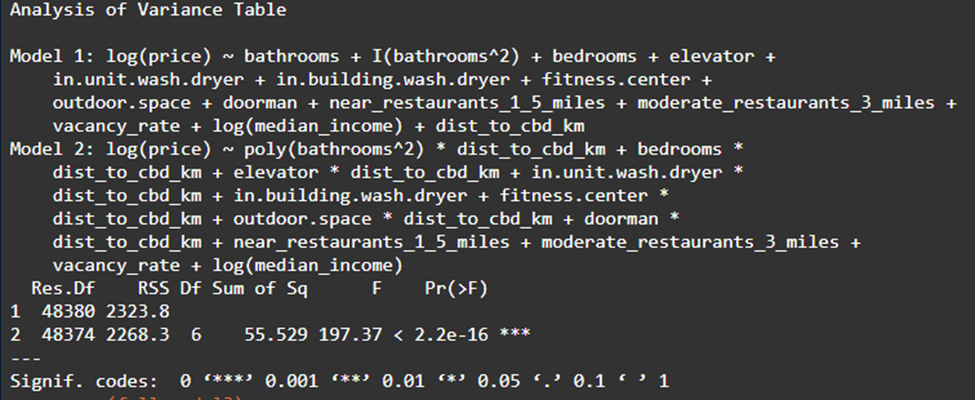

## Introduction

Over the past decade, data analytics has become an essential tool for understanding real estate markets, especially in massive complex markets like New York City. For example, rental prices are influenced by a wide range of factors like income accessibility, amenities, neighborhood, and so much more. While there are many contribution factors, it’s difficult to determine which of these truly drive rental prices, and how they interact with one another.

This project’s goal is to analyze what features best influences apartment rental prices across New York City. In particular, the goal is to identify which economic, geographic, and lifestyle factors are most strongly associated with the expected asking rent of an individual apartment. We analyzed features on both the individual apartment level and neighborhood level to quantify how much individual apartment features impact pricing compared to the neighborhood’s community characteristics.

To address this question, a wide range of data was collected at both the apartment and neighborhood levels. At the apartment level, features such as the number of bedrooms and bathrooms, as well as building amenities like in-unit laundry and doorman services, were included. At the neighborhood level, more general characteristics were gathered, including average apartment sale prices, measures of neighborhood safety, school quality, and accessibility factors such as ease of movement, transportation options, and distance from downtown measured as the distance from the world trade center.  For the statistical methods, we implemented LASSO regression, random forest regression, and multilinear regressions. The use of regularization was considered, and feature selection was heavily influenced by random forests to find the most important predictors of rent,and by using the multilinear regression to find the relationship of the features to rents.

The goal of this analysis is to better understand the key drivers of rental pricing in New York City and determine whether factors such as accessibility and amenities have a measurable impact beyond basic economic indicators like income and property values.

## Data Overview

To answer our original questions, we had to gather a wide range of data which we categorized into two sections: The neighborhood dataset, and the apartment dataset. The neighborhood dataset acts as a supplement to the apartment dataset which the project is mainly based on. It contains aggregated information from 37 neighborhoods across New York City, with each row representing a new area.

The neighborhood data began with determining a set of features that were “must-have” and “nice-to-have.” Within the “must-have” category, we identified subway accessibility and restaurant/nightlife density as essential variables. These features were selected because they capture two critical aspects of living in a large city: mobility and amenities. Areas with greater access to subway stations are typically more desirable due to increased ease of transportation, while neighborhoods with a higher concentration of restaurants and nightlife options tend to offer more leisure opportunities, which can contribute to higher demand and, ultimately, higher rental prices. More features like walk and transit scores, green space availability, median household income, school district quality, and average rent were also collected and categorized as “nice-to-have” variables. While these factors provide useful context and may influence rental prices, they were not completely essential to the models we planned on running. They were included to improve the models and capture broad characteristics of neighborhood quality, allowing us to determine if these characteristics add actual explanatory power beyond the features listed in the “must-have” category. Because this analysis included many different data sources the next step was to figure out how to join each feature to a common item. Most datasets included a neighborhood name, so this was the common denominator when cleaning and appending into a final neighborhood data frame.

It's important to note that neighborhood names are not recorded the same across the datasets we had gathered. This proved to be a difficult obstacle when cleaning and creating the final neighborhood data set. For example, the dataset for average asking rent used names such as "Chelsea" and "Murray Hill Kips Bay" while the dataset for school information used "Chelsea/Clinton" or "Murray Hill/Stuyvesant" because school districts are recorded differently. To address this issue, neighborhood names were standardized across all datasets using a combination of automated cleaning and targeted mapping. This process involved changing all names to the same format (lowercase, removing punctuation, and trimming spaces), as well as splitting combined neighborhood names where needed. For example, rows like “Chelsea/Clinton” were separated into individual neighborhoods to match with other datasets.

In addition to the automated cleaning, a small number of issues were fixed using targeted mappings to match similar or overlapping neighborhood definitions. The rent dataset was used as the base reference, or "truth", and other datasets were adjusted to match its naming structure as closely as possible. This approach helped achieve an impactful increase in overlap between datasets (from 9 common names to 37) so they could be joined together. Once standardized, the datasets were successfully merged using the neighborhood field, and values were aggregated when needed to make a consistent neighborhood-level dataset for analysis.

The dataset used in this analysis has several key strengths that make it useful for regression analysis. First, it combines information from multiple categories, which creates a more comprehensive view of neighborhood characteristics. By incorporating economic, geographic, and amenity-based variables, the dataset doesn’t become siloed into just an economic analysis or just a geographic analysis but looks at a multitude of factors that may influence rental prices. Additionally, the use of feature engineering to create composite scores (like movement, restaurant, and green space indices) helps reduce complexity and makes the data more useable. The final dataset also covers a large area of New York City, with 37 neighborhoods included in the analysis. However, the dataset also has several limitations. As mentioned before, one major challenge is the inconsistency in how neighborhoods are defined across different data sources, which require significant cleaning and mapping. While this process improved the number of neighborhoods covered, it introduced some degree of overlap when aligning different geographic definitions. The lines between neighborhoods are not perfectly defined. Additionally, some variables contained missing data, which reduced the number of usable observations in certain models and may impact the reliability of those results. For example, the green score didn’t contain neighborhood level data. To solve this issue, the median green score of each borough was taken and applied to its neighborhoods.

## Methodology

To begin, we first did LASSO and random forest regression on the unit level dataset, to find significant predictors and measure predictor strength to determine if higher order or interaction effects were necessary from the apartment dataset.

The final random forest model, based solely on unit-level features, managed to improve the R² to 0.6233.](images/clipboard-3734808285.png)

We did not create a linear model at this stage, because we believed that the R² of such a model would be too low for confident inference on the apartments.

As a result, we then moved on to the neighborhood analysis and subsequent conjoining of the two datasets and analyses. The goal of analyzing the neighborhood characteristics was to identify which features best predict average rental prices across New York City neighborhoods, as we believe that if we could accurately capture the relative effect of the neighborhood on unit price, we could then accurately isolate the unit level features effects on price.

Given the high number of variables collected and the likelihood of correlation between them, we used a multi-step modeling approach to isolate the most important predictors. The first step in our analysis was to run a LASSO regression model which we chose because it performs both variable selection and regularization. This allowed us to choose a subset of meaningful predictors from the larger group of potentially correlated variables. The LASSO results showed that only a few variables, such as median income, market sale price per unit, bike score, early education enrollment, and total green acers contributed meaningful explanatory power, while most others were effectively removed.

One result that surprised us was the total green acers having a negative lambda of -5.235, but upon closer inspection this makes sense. The most expensive rent prices are in Manhattan, and the green space data includes all boroughs in NYC. Boroughs like Staten Island and Brooklyn have lower rents than Manhattan because of more supply and less demand for apartments, but these places also have more green space overall. This led us to the conclusion that green space is more of a location proxy to Manhattan, rather than a contribution factor to rental pricing.

Following the LASSO regression, we used liner regression models to better understand the relationships between key neighborhood features and average rental prices in those neighborhoods. The result of the second model showed that market sale price per unit was the main predictor, explaining a large portion of variation in rent (R² ≈ 0.91). However, when we included it in a multiple regression model, this variable overshadowed all others, suggesting that property sale values act as a strong proxy for many neighborhood features.

To try and isolate the effects of the underlying neighborhood features, we introduced composite scores and re-ran our model. We created a composite score for education, movement, restaurants, and green space. We also decided to exclude sale price per unit in the revised regression to see if we could maintain explanatory power with the less impactful predictors. We were pleased to see this model maintain strong explanatory power (R² ≈ 0.83) and identified median income, vacancy rate, and green space as significant predictors of rent, while movement and restaurant variables were not statistically significant. These results suggest that, beyond property values, economic conditions and broader geographic features play the most important role in determining rental prices.

Once the neighborhoods dataset was thoroughly analyzed, we extracted the key features the LASSO regression had isolated; median_income, green_score, vacancy_rate, and restaurants_3_miles, and joined them onto the apartment dataset. As before, we began doing variable selection by using Random Forest regressions to capture the significant features within the combined model. We found that from the new predictors median_income, and vacancy_rate where significant predictors within the combined model, while, green_score was mostly exclueded from the random forest, and so was excluded as a predictor going forward.

Finally, we then used these variables to create a linear regression model, regressing on log(price) because we suspected the dataset to be right skew. The model performed decently, obtaining an adjusted R² of 0.7046. However, it had clear issues with heteroskedasticity, and despite logging price, wide tails and right skew.

We also calculated the VIF of each variable, which came out to be under the threshold for problematic multicollinearity for each predictor, and created component residual plots showing that bathrooms had a non-linear effect. Because the heteroskedasticity was so extreme, we suspected there was a confounding variable we had missed. To counteract this, we added in the variable dist_to_cbd_km, which measured the distance from any given unit to the World Trade Center. We hoped this variable would capture some of the value of neighborhoods in NYC that was causing the heteroskedasticity, wide tails, and right skew. Additionally, we added interaction effects into the model for bathrooms, bedrooms, elevator, in unit washer and dryer, fitness center, outdoor space and doorman. The variable dist_to_cbd_km is coded so that it increases the further away from the world trade center the unit is. We then ran an F-test over these interaction effects. Which was highly significant.

This model performed better than expected, with an adjusted R² of 0.7336, however the structural heteroskedasticity, wide tails, and right skew remained. As a result, we had to fit another model using Huber M-estimation and H1C, which is robust to heteroskedasticity. The coefficients and standard errors were substantially unchanged, showing that the findings were not driven by outlying observations.

## Results

#### Model Overview

Our final linear model regresses log(price) on a combination of unit and neighborhood level features and includes interaction terms capturing how unit-level premiums vary within distance from downtown Manhattan (centered on the World Trade Center). The model uses 48,395 rental listings across 36 NYC neighborhoods, achieving an adjusted $R^2$ of 0.736, indicating that our model explains approximately 74% of the variation in log rental price. Due to persistent heteroskedasticity at higher fitted values, we report HC1 heteroskedasticity-consistent standard errors through. As a robustness check, we also fit the model using Huber M-estimation (rlm). The coefficient estimates were substantively unchanged, confirming that our findings are not driven by outlying observations.

#### Unit-level Features

Because distance to CBD was mean-centered, the main effect of coefficients represents the estimated premium at the average distance from downtown. All percentage effects are approximate, derived from the log-linear specification.

The relationship we found between bathrooms and rent appeared to be nonlinear. The linear coefficient (β = 0.218, p \< 0.001) and the positive quadratic term (β = 0.067, p \< 0.001) together indicate that each additional bathroom is associated with a substantial rent increase, with an accelerating premium at higher bathroom counts. This likely reflects the fact that multi-bathroom apartments in NYC are genuinely rare for luxury units, thus commanding disproportionately large premiums.

Each extra bedroom is associated with approximately 17% higher rent (β = 0.166, p \< 0.001), consistent with the standard per-room pricing convention in the NYC rental market.

For the binary unit and building amenities, having a doorman commands the highest premium of the features we measured, with a 14% increase in expected rental price holding all other variables constant (β = 0.134, p \< 0.001), followed by in unit washer/dryer at 8% (β = 0.080, p \< 0.001), elevator at 7% (β = 0.066, p \< 0.001), and fitness center at 5% (β = 0.055, p \< 0.001). Additionally, we noted that in-building washer/dryer is associated with an approximately 6% lower rent compared to the baseline. We believe that this likely indicates buildings with in-building washer/dryers are generally older and less expensive, rather than that shared laundry facilities decrease the apartment's value.

Similarly, outdoor space is associated with approximately 1.3% lower rent (β = –0.013, p \< 0.001). We interpret this as outdoor space generally increasing as you get further from downtown, where it signals a ground-floor or low-level unit, rather than luxury apartments associated with premium Manhattan listings.

#### Neighborhood-level features

Distance from the CBD (World Trade Center) is the single strongest neighborhood-level predictor we found in our model. Each additional kilometer from downtown is associated with approximately 4.5% lower rent (β = –0.045, p \< 0.001), demonstrating the expected effect centrality premium in NYC’s rental market.

Neighborhood median household income is positively associated with rent (β = 0.0000157, p \< 0.001). While the per-dollar coefficient appears small, this translates to meaningful effects across the income distribution: a \$50,000 difference in neighborhood median income is associated with approximately 8% higher rent, all else equal.

Restaurant density within 3 miles has a small but statistically significant positive association with rent (β = 0.003, p \< 0.001), serving as a proxy for neighborhood vibrancy and commercial activity. Vacancy rate is negatively associated with rent (β = –0.018, p \< 0.001), confirming that tighter rental markets with lower vacancy command higher prices.

### Interaction Effects: How Location Modifies Amenity Premiums

A key finding of this analysis is that unit-level amenity premiums are not uniform across the city. The inclusion of interaction terms between unit features and distance to CBD significantly improved model fit (F = 197.37, p \< 0.001 via nested ANOVA), and revealed several substantively interesting patterns.

The doorman premium increases further from downtown (β*interaction* = 0.017, p \< 0.001). At the mean distance, a doorman adds \~14% to rent; 10 km further out, this premium grows to approximately 31%. This likely reflects that doorman buildings are rarer and more differentiated in outer boroughs, making them a stronger signal of building quality relative to their surroundings.

The bedroom premium also increases with distance (β*interaction* = 0.006, p \< 0.001), suggesting that additional space is valued more in areas where larger apartments are the norm. The in-unit washer/dryer premium similarly increases with distance from CBD (β*interaction* = 0.007, p \< 0.001).

Conversely, outdoor space becomes even less valuable further from the CBD (β*interaction* = –0.003, p \< 0.001), reinforcing the interpretation that outdoor space in the outer boroughs is associated with lower-quality housing stock rather than premium amenities.

## Conclusion

This project’s goal is to analyze what features best influences apartment rental prices across New York City. In particular, the goal is to identify which economic, geographic, and lifestyle factors are most strongly associated with the expected asking rent of an individual apartment. Using approximately 48,000 rental listings and a log-linear regression model, we find that both in-unit and neighborhood features matter substantially, but in distinct ways.

At the unit level, the number of bathrooms, bedrooms and doorman status are the dominant predictors. A doorman building commands the single largest binary amenity premium at roughly 14% at the average location. In-unit washer/dryer ad elevator access add meaningful premiums of 8% and 7% respectively, while in-building washer is negatively associated with rent—a finding that underscores the importance of interpreting amenity variables in context, not just the amenity itself.

At the neighborhood level, proximity to downtown was the strongest predictor, with each additional kilometer from the CBD associated with approximately 4.5% lower rent. Neighborhood median income, restaurant density, and vacancy rate all contribute significant additional explanatory power. Together, these findings confirm that renters are paying for both what is inside their apartment and for where it is located.

Perhaps the most interesting finding was from our interactions, that amenity premiums are not constant across the city. The doorman premium nearly doubles comparing downtown units to units in the outer boroughs, while counterintuitively, outdoor space becomes increasingly associated with lower rents further from the city center. These findings suggest that the same amenity carries different market signals depending on its geographic location within the city.

### Limitations

Several limitations should be noted. First, our unit data originates from RentalHop listings from 2017, which is unlikely to fully reflect current-post covid market conditions. Second, our residual analysis indicates persistent heteroskedasticity, heavy tails and right skew. We addressed the heteroskedasticity using H1C robust standard errors, and confirmed coefficient stability using Huber M-estimation, but acknowledge that features such as unit finishes, views, floor levels, and building prestige are likely to drive the remaining unexplained variance. Additionally, around 1700\~ observations were excluded due to missing neighborhood features, and median incomes and vacancy rates for certain neighborhoods were imbued with the calculated median of the surrounding areas. Finally,  our neighborhood features, while significant, do not capture the full set of characteristics that make a neighborhood desirable. Subjective qualities such as “vibe”, perceived safety, and school quality could not be included due to the data being too sparse.

### Implications

For renters, our results provide a data-driven framework for understanding what they are paying for when they sign a lease in New York City. The findings suggest that a prospective renter weighing up a doorman building in Brooklyn versus a non-doorman building in Manhattan face a larger premium than they may expect, and that amenities like outdoor space may not command the premium one might intuitively assume. For future work, incorporating additional spatial features, such as subway proximity, school district quality, and street-level data could further improve the models explanatory power and provide even more granular guidance for NYC apartment seekers.
